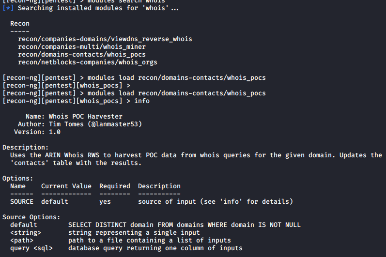
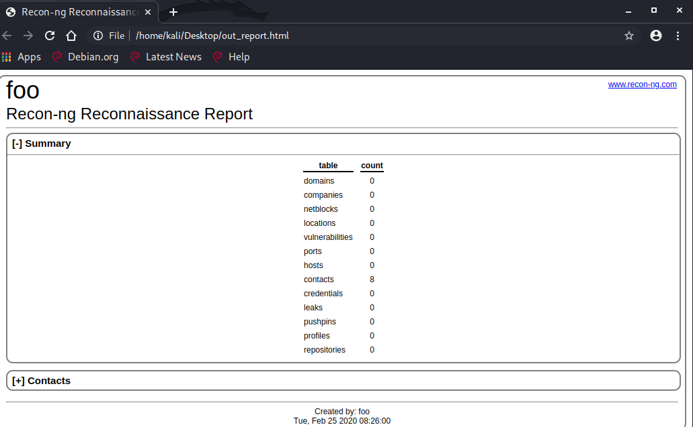

I'm following Chapters 4 (Passive Information Gathering) and 5 (Active Information Gathering) of Learn Kali Linux 2019.

These two chapters compare the difference between Passive and Active Information Gathering.

Passive Information Gathering is doing recon on a target without making a direct connection to it. The term Open Source Information Intelligence refers to using publicly available information.

One can use the the largest available network for this kind of information gathering: the internet. Social media, blogs, Maps, forums, organisation websites, search engines and many more can be used for gathering information against a target. 

recon-ng is an example program you can use in Kali Linux. It is a very modular program with addons that can be installed using the marketplace.

Here is an example of how to download contact details from an organisation using the publicly available whois command. This can be installed by doing `marketplace install all`.

Once done, you can even generate a report against an org:

If you don't want to go through the hassle of installing Kali Linux, you can even use a search engine called Netcraft to do this work for you.

https://www.netcraft.com/

For example, would you like to know what is Google running on?

https://sitereport.netcraft.com/?url=https://www.google.com

Active information gathering on the other hand is about doing reconnaissance against a target by directly connecting to it. It can bring its own risks but different kinds of rewards. More on this on the next blog update.

References:

Chapter 5: Passive Information Gathering Kali Linux 2019
