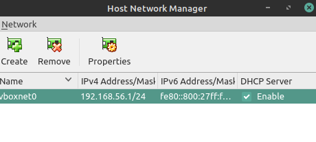
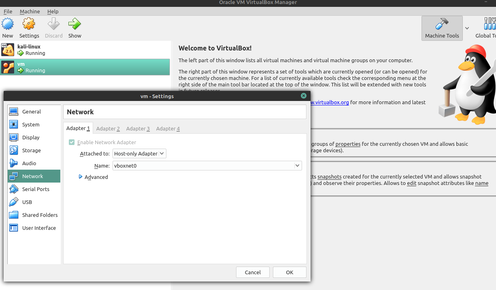
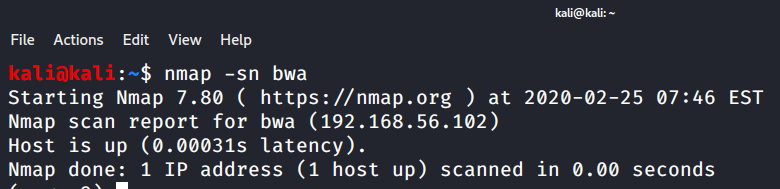
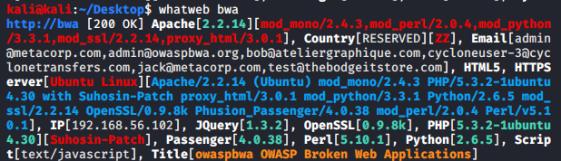
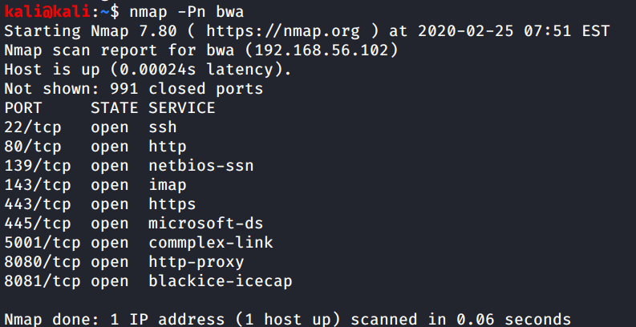
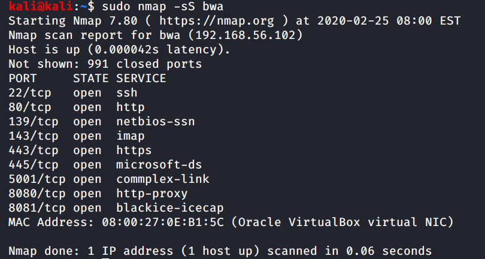

This is my Something Awesome Project Week 2 Update.

So I've downloaded Broken Web App VM and Installed Kali Linux in Virtual Box.

The first step is to get things setup.

Networking setup in VirtualBox
* Create an internal network so that Kali Linux can attack the Broken Web App
* VirtualBox -> File -> Host Networks 

With this setup, Kali Linux can now communicate with the Broken We App VM.

I've added the ipaddress to /etc/hosts. I'll be referring to it as bwa

Let's do some simple recon against the target machine. 

We can do a ping sweep using nmap to check if the machine is there.

Yeah it's up.

I wan't to know more than it is up. What applications are potentially inside?

We can use the `whatweb` program to check against the target machine. 

What if the host has ICMP disabled?
* It will not respond to pings
* We can skip the host discovery using `-Pn`

Stealth scan
* By default Namp creates a three way TCP handshake using SYN, SYN/ACK, and ACK
* If we want to be stealthy on how we scan a target, we can specify a `-sS` operator to do a stealth scan.
* It does it by sending a reset at the last handshake.

Resources:
* OWASP Broken Web App: https://owasp.org/www-project-broken-web-applications/
* https://www.kali.org/
